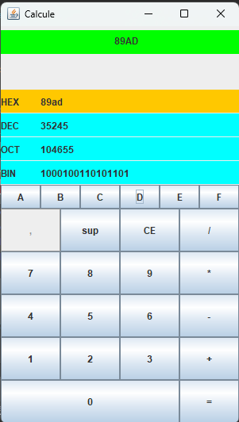

## Fonctionnalités

- Lancer le programme.
- Cliquez sur les boutons numériques pour saisir un nombre.
- **Choisissez le système de numérotation dans lequel vous voulez saisir le nombre** en sélectionnant simplement l'un des boutons **HEX**, **DEC**, **OCT** ou **BIN**. Le nombre que vous entrez sera interprété dans le système choisi.
- Utilisez les boutons d'opération (`+`, `-`, `*`, `/`) pour effectuer des calculs.
- Le résultat sera affiché instantanément dans les différents systèmes de numérotation.
- **Exemple1: 89AD/12=7A6**
-       
-  **Exemple2: 7A6/0=erreur**
-        
-  **Exemple3: l'affichage de l'interface dans le système BIN**
-  
